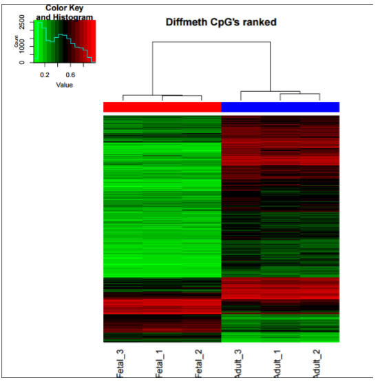

# odam_epigenomics
Practises in R and Python of epigenomics subject. Omics data analysis Master.

# Álvaro Ponce Cabrera 

*The data you are about to analyze comes from a published paper.  The idea behind this exercise is that you must show the acquisition of concepts that we saw at the lessons, i.e:*

1. *Loading and normalization of the data*
2. *Filtering* 
3. *Standard differential methylation analysis*
4. *GO enrichment analysis 5. Put into Biological context the results*
 
*Here are the questions you must solve:*
 
1. *How many samples are Masculine and how many feminine?(5)* 
 	
	All the samples are Masculine. 

2. *About the detection p-values from the loading of raw data, how many samples must be removed from the study because the sums of their pvalues for all CpGs are over 0.05? Why? (10)* 

	No samples have to be removed because all of them have means of pvalues over than 0.05 

3. *How many differential methylated CpGs  did you find, considering qval less than 0.01 and  absolute difference in methylation  over 0.2 (10)*
	
	39186 

4. *How many differentially methylated CpGs are in promoter? (10)*

	15728 

5. *How many differentially methylated CpGs are in promoter and island? (10)* 
	
	3040	

6. *How many differentially methylated CpGs are in promoter and island, are hypermethylated in fetal group ( beta val over =.066) ? How many of this hypermethylated change to hypomethylated ( beta val lower than =0.33) in adult? (10)* 

	283 are hypermethylated in fetal group and 20 of this are hypomethylated in adult. 
	
7. *I added a list of differentially expressed genes from the same times series ( file diff.expressed.AdultvsFetal.csv), load them. The column logFC is the log Fold change of Adult vs Fetal, i.e positive is overexpressed in Adult). Select those ones with over expression over logFC>2 and tell how many are in differentially methylated in promoter and islands. (15)*
 
	68 

8. *Conduct a GO enrichment analysis of the Genes in promoter and island differentially methylated CpGs : Do you think the genes that are differentially methylated are involved somehow in the procedure of the liver formation in the embryogenesis? Why? Give some examples to explain yours answers. (25)*
 
	We can see several entries related with embryonic morphogenesis in the GO enrichment analysis of Biological Process.  There is no specific entry talking about liver formation, however we can see, for instance “organ morphogenesis” or “organ development”, so we can assume the liver is inside these processes, and there should be diferentially methylated CpGs too. 
	
	Here we are some examples: 
	"GO:0009887",2.46090368464106e-21,"organ morphogenesis",158,"GO:0009887”. 
	"GO:0048513",6.42236376606443e-21,"organ development",372,"GO:0048513". 
	"GO:0048562",3.17809821848538e-19,"embryonic organ morphogenesis",73,"GO:0048562". "GO:0048568",5.44909995366216e-19,"embryonic organ development",93,"GO:0048568". 
	
9. *Plot a heatmap of these Cpgs, what can you tell me from this heatmap , in terms of split of the samples,  methylation patterns of each group.(10)*
 
	As we can see the two different groups are obviously different in the methylation pattern. In addition, in adult samples it seems that the methylation level is higher than it is in fetal samples. Maybe it is related with the silence of genes that humans suffer during the pass of the years. It is probed that in the embryogenesis the expression level of genes is higher.  
	
	